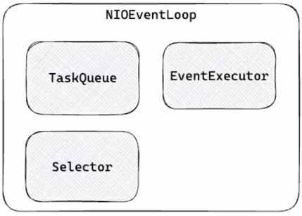

* CompletableFuture
* https://mangkyu.tistory.com/263
* https://dev-coco.tistory.com/185
* https://recordsoflife.tistory.com/1469
* https://velog.io/@juhwanheo/Java-ListCompletableFuture%EB%A5%BC-%EC%82%AC%EC%9A%A9%ED%95%98%EB%A9%B4%EC%84%9C
* https://11st-tech.github.io/2024/01/04/completablefuture/

1. 비동기 작업 실행 : runAsync, supplyAsync
2. 작업 콜백 : thenApply, thenAccpet, thenRun
  - thenApply
  반환 값을 받아서 다른 값을 반환함
  함수형 인터페이스 Function을 파라미터로 받음

  @Test
  void thenApply() throws ExecutionException, InterruptedException {
      CompletableFuture<String> future = CompletableFuture.supplyAsync(() -> {
          return "Thread: " + Thread.currentThread().getName();
      }).thenApply(s -> {
          return s.toUpperCase();
      });
      System.out.println(future.get());
  }

  - thenAccpet
  반환 값을 받아 처리하고 값을 반환하지 않음
  함수형 인터페이스 Consumer를 파라미터로 받음

  @Test
  void thenAccept() throws ExecutionException, InterruptedException {
      CompletableFuture<Void> future = CompletableFuture.supplyAsync(() -> {
          return "Thread: " + Thread.currentThread().getName();
      }).thenAccept(s -> {
          System.out.println(s.toUpperCase());
      });  
      future.get();
  }

  - thenRun
  반환 값을 받지 않고 다른 작업을 실행함
  함수형 인터페이스 Runnable을 파라미터로 받음

  @Test
  void thenRun() throws ExecutionException, InterruptedException {
      CompletableFuture<Void> future = CompletableFuture.supplyAsync(() -> {
          return "Thread: " + Thread.currentThread().getName();
      }).thenRun(() -> {
          System.out.println("Thread: " + Thread.currentThread().getName());
      });  
      future.get();
  }

3. 작업 조합 : thenCompose, thenCombine, allOf, anyOf
  - thenCompose
  두 작업이 이어서 실행하도록 조합하며, 앞선 작업의 결과를 받아서 사용할 수 있음
  함수형 인터페이스 Function을 파라미터로 받음

  @Test
  void thenCompose() throws ExecutionException, InterruptedException {
      CompletableFuture<String> hello = CompletableFuture.supplyAsync(() -> {
          return "Hello";
      });

      // Future 간에 연관 관계가 있는 경우
      CompletableFuture<String> future = hello.thenCompose(this::mangKyu);
      System.out.println(future.get());
  }
  
  private CompletableFuture<String> mangKyu(String message) {
      return CompletableFuture.supplyAsync(() -> {
          return message + " " + "MangKyu";
      });
  }

  - thenCombine
  두 작업을 독립적으로 실행하고, 둘 다 완료되었을 때 콜백을 실행함
  함수형 인터페이스 Function을 파라미터로 받음

    @Test
    void thenCombine() throws ExecutionException, InterruptedException {
        CompletableFuture<String> hello = CompletableFuture.supplyAsync(() -> {
          return "Hello";
        });

        CompletableFuture<String> mangKyu = CompletableFuture.supplyAsync(() -> {
          return "MangKyu";
        });

        CompletableFuture<String> future = hello.thenCombine(mangKyu, (h, w) -> h + " " + w);
        System.out.println(future.get());
    }

  - allOf
  여러 작업들을 동시에 실행하고, 모든 작업 결과에 콜백을 실행함

    @Test
    void allOf() throws ExecutionException, InterruptedException {
        CompletableFuture<String> hello = CompletableFuture.supplyAsync(() -> {
            return "Hello";
        });

        CompletableFuture<String> mangKyu = CompletableFuture.supplyAsync(() -> {
            return "MangKyu";
        });

        List<CompletableFuture<String>> futures = List.of(hello, mangKyu);

        CompletableFuture<List<String>> result = CompletableFuture.allOf(futures.toArray(new CompletableFuture[futures.size()]))
            .thenApply(v -> futures.stream().
                    map(CompletableFuture::join).
                    collect(Collectors.toList()));

        result.get().forEach(System.out::println);
    }

  - anyOf
    여러 작업들 중에서 가장 빨리 끝난 하나의 결과에 콜백을 실행함

    @Test
    void anyOf() throws ExecutionException, InterruptedException {
        CompletableFuture<String> hello = CompletableFuture.supplyAsync(() -> {
            try {
                Thread.sleep(1000L);
            } catch (InterruptedException e) {
                throw new RuntimeException(e);
            }

            return "Hello";
        });

        CompletableFuture<String> mangKyu = CompletableFuture.supplyAsync(() -> {
            return "MangKyu";
        });

        CompletableFuture<Void> future = CompletableFuture.anyOf(hello, mangKyu).thenAccept(System.out::println);
        future.get();
    }

4. 예외 처리 : exeptionally, handle/handleAsync
  - exeptionally
  발생한 에러를 받아서 예외를 처리함
  함수형 인터페이스 Function을 파라미터로 받음

    @ParameterizedTest
    @ValueSource(booleans =  {true, false})
    void exceptionally(boolean doThrow) throws ExecutionException, InterruptedException {
        CompletableFuture<String> future = CompletableFuture.supplyAsync(() -> {
            if (doThrow) {
                throw new IllegalArgumentException("Invalid Argument");
            }    
            return "Thread: " + Thread.currentThread().getName();
        }).exceptionally(e -> {
            return e.getMessage();
        });    
        System.out.println(future.get());
    }
    
    java.lang.IllegalArgumentException: Invalid Argument
    // Thread: ForkJoinPool.commonPool-worker-19

  - handle, handleAsync
  (결과값, 에러)를 반환받아 에러가 발생한 경우와 아닌 경우 모두를 처리할 수 있음
  함수형 인터페이스 BiFunction을 파라미터로 받음

    @ParameterizedTest
    @ValueSource(booleans =  {true, false})
    void handle(boolean doThrow) throws ExecutionException, InterruptedException {
        CompletableFuture<String> future = CompletableFuture.supplyAsync(() -> {
            if (doThrow) {
                throw new IllegalArgumentException("Invalid Argument");
            }    
            return "Thread: " + Thread.currentThread().getName();
        }).handle((result, e) -> {
            return e == null
                    ? result
                    : e.getMessage();
        });    
        System.out.println(future.get());
    }
