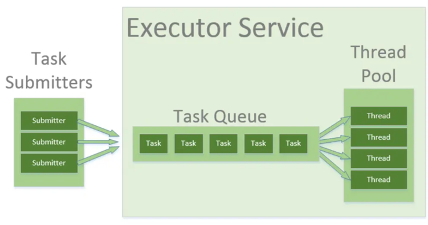
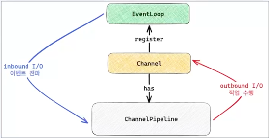

- 
- Project reactor
- Spring reactor
- Mono 와 Flux publisher 제공
- org.reactivestreams
- emit : 내보내다.

# Flux
- 0 또는 N개의 아이템을 emit 할 수 있는 publisher
- Subscriber가 50개의 아이템 요청 - Publisher가 3개 밖에 없다면?
  - 3개 emit하고 onComplete
  - 처리 중에 에러 발생 시 onError

# Flux.just
- .just() 를 통해 생성할 때에도 다수의 인자를 입력할 수 있다. (Flux.just(T...))
- Flux<Integer> integerFlux = Flux.just(1, 2, 3, 4);
- integerFlux.subscribe(i -> System.out.println("Subscriber 1 : " + i));

# From Array / List 
- https://gngsn.tistory.com/227
- Flux.fromIterable() 을 통해 Iterable한 자료구조로부터 Flux를 간편하게 생성할 수 있다.
- List<String> strings = Arrays.asList("a", "b", "c");
- Flux.fromIterable(strings)
  .subscribe(...)

# From Stream
###### List<Integer> list = List.of(1, 2, 3, 4, 5);
###### Stream<Integer> stream = list.stream();
###### stream.forEach(System.out::println);
###### stream.forEach(System.out::println); //error
- Java 8의 Stream은 one time use 이기 때문에, 
- 동일한 Stream을 다시 사용했을 때에는 'stream has already been operated upon or closed' 에러를 볼 수 있다.
- Flux도 동일할까? 그렇다.

###### // Stream을 통해 생성된 Flux는 Subscriber가 재구독할 시에 에러
###### Flux<Integer> integerFlux = Flux.fromStream(stream);
###### integerFlux.subscribe(...);
###### integerFlux.subscribe(...); //error

###### // Flux에 대한 Subscribe 행위가 일어날 때마다 기존 List의 Stream을 생성한다면
###### Flux<Integer> integerFlux = Flux.fromStream(() -> list.stream());
###### integerFlux.subscribe(...);
###### integerFlux.subscribe(...); //good

# Flux.range
# log
- Flux 파이프라인에 .log()을 끼워 넣어서 어떤 시그널들이 전달되고 있는지를 염탐할 수 있다.
- map operator 전후로 log를 끼워 넣었을 때 로깅되는 데이터가 달라질 때 유용하게 사용할 수 있을 것 같다.
- https://velog.io/@redjen/Java-Reactive-Programming-3-Flux
- AtomicReference 사용 방법
- https://codechacha.com/ko/java-atomic-reference/

# Flux vs List
- 여러 개의 데이터 원소를 받기 위해서는 어떤 방법을 쓸 수 있을까?
- List 에 데이터를 채운 후 사용하려면.. 데이터가 전부 채워질 때까지 기다려야 한다. (블락킹)
  - 데이터의 개수가 엄청 많거나
  - 엄청 큰 데이터를 List 에 담는다고 한다면 상당히 많은 시간이 걸린다.
- 이는 Flux 를 사용해서 개선할 수 있다.
- 하나의 원소를 제네레이팅 한 다음 처리하고, 다음 원소가 제네레이팅 된 직후 처리하고..
- 조금 더 컴퓨팅 자원을 효율적으로 사용할 수 있게 된 것이다.
- 다만 Flux 는 List 처럼 Collection 도 아니고, 자료구조도 아니다.
- 데이터를 어떻게 전달해줘야 하는지에 대한 개념 혹은 명세에 가깝다는 생각이다.

# Interval
- 전달할 때 짧은 주기를 가지고 데이터를 전달하려면 Flux.interval 을 사용해서 Flux 를 사용하면 된다.
  ###### Flux.interval(Duration.ofSeconds(5))
  ###### .subscribe(System.out::println);
  ###### Sleep(5);

# Another Publisher to Flux
- Mono 에서 Flux 로 변경하려면 어떻게 해야 할까?
- Flux.from() 은 특정 형태의 Publisher 를 Flux 로 변경해주는 메서드이다.
  ###### Mono<String> mono = Mono.just("a");
  ###### Flux<String> flux = Flux.from(mono);

# Flux to Mono
###### Flux.range(1, 10)
  ###### .next()
  ###### .subscribe(System.out::println);

- Flux 는 0에서 N개의 아이템을 전달한다. 
- 그 중 하나만을 선택해서 Mono 로 전달하려면 .next() 메서드를 사용해서 전달한다.
- next()는 다음 onNext 시그널에 전달되는 아이템을 단일 Mono 로 전달한다.

# Flux 생성 (FluxSink)
- https://velog.io/@redjen/Java-Reactive-Programming-4-Flux-%EC%83%9D%EC%84%B1
- https://gngsn.tistory.com/227

