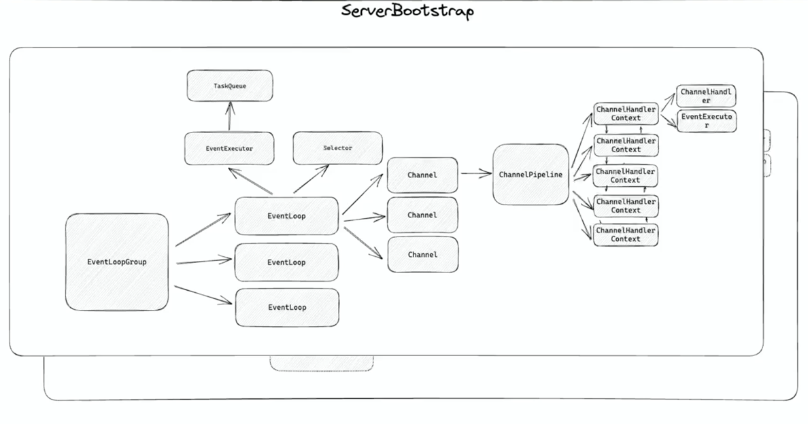
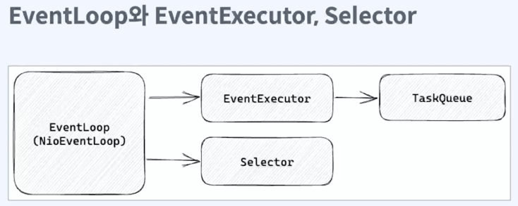

* 함수 호출 관점

* 내부 동작 관점

* Java IO
- 파일과 네트워크에 데이터를 읽고 쓰는
- byte 단위 기반 stream (InputStream, OutputStream)
- 동기 blocking 으로 동작
- 메모리 카피가 생긴다

* Java NIO
- buffer 단위 기반 (New)
- non-blocking 지원
- selector, channel 도입으로 높은 성능 보장

* flip : 
- Buffer 의 limit 위치를 현재 Position 위치로 이동시키고, Position 을 0 으로 리셋
- Buffer 를 쓰기 모드에서(버퍼에 채운다) 읽기 모드로 전환하는 경우 사용

* rewind :
- Buffer 의 Position 위치를 0 으로 리셋. limit 은 유지
- 데이터를 처음부터 다시 읽는 경우 사용

* clear
- Buffer 의 limit 위치를 capacity 위치로 이동시키고, Position 을 0 으로 리셋
- Buffer 를 초기화할때 사용

* Java AIO (NIO2)
- AsynchronousChannel 
- AsynchronousSocketChannel
- AsynchronousServerSocketChannel
- AsynchronousFileChannel
- callback 과 future 지원
- Thread pool 과 epoll, kqueue 등의 이벤트 알림 system call 이용

