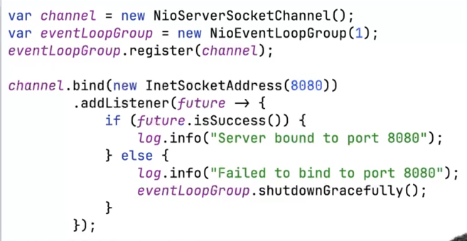

* NIOEventLoop
* 
- ioRatio : 기본 50
- 100 이면 I/O task 먼저 처리, Non I/O task

* NIOEventLoopGroup
- 
- NIOEventLoop 은 직접 생성할수 없기 때문에 NIOEventLoopGroup 을 사용

* ExecutorService
- 

* ChannelPipeline (Channel 은 Pipeline 을 가지고 있다)
- 
- 

- ChannelHandlerContext
- 

* 
* 
* 
* 