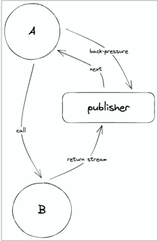
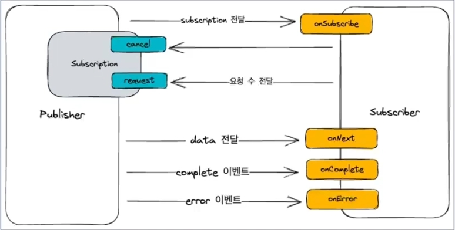

# Reactive Streams
1. Callee는 Caller에게 응답이 아닌 publisher를 제공한다.
2. Callee는 각각의 값을 publisher를 통해서 전달한다.
3. Caller는 해당 Publisher를 subscribe 하거나 다른 Caller에게 전달한다
4. Caller는 subscriber를 등록히여 back-pressure를 조절하여 처리 가능한 만큼만 전달 받는다.

- Callee는 publisher를 반환하고 Caller는 subcriber를 등록한다. 이 과정에서 Caller와 Callee는 비동기적으로 동작한다.
- publisher는 메세지 큐를 생성해서 부화를 관리하고 흐름을 제어한다. back-pressure를 조절할 수 있는 수단을 제공한다.

# Reactive Stream 구조

- 데이터 혹은 이벤트를 제공하는 Publisher
- 데이터 혹은 이벤트를 제공받는 Subscriber
- 데이터 흐름을 조절하는 Subscription

- Publisher   ---------->   Subscriber (onSubscribe)
  - Subscription (리모컨) 전달
    - cancel : 더 이상 요청을 받지 않을거야.
    - request : 내가 몇개의 요청을 받아 갈거야 
- data 이벤트   ---------->   onNext
- complete 이벤트 ---------->   onComplete
- error 이벤트  ---------->   onError                          

