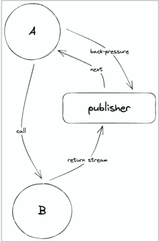
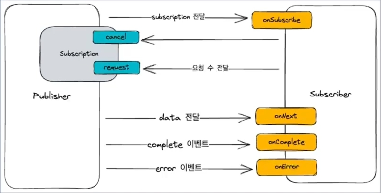
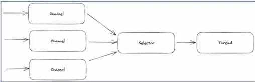
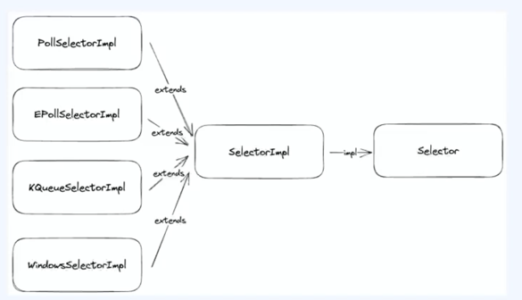
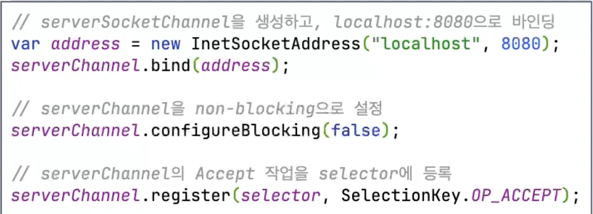
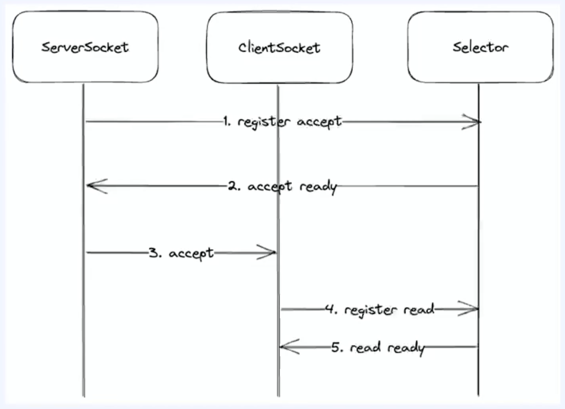
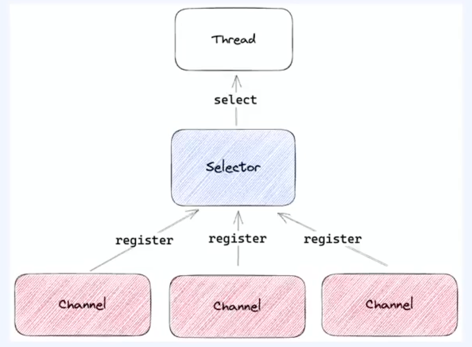
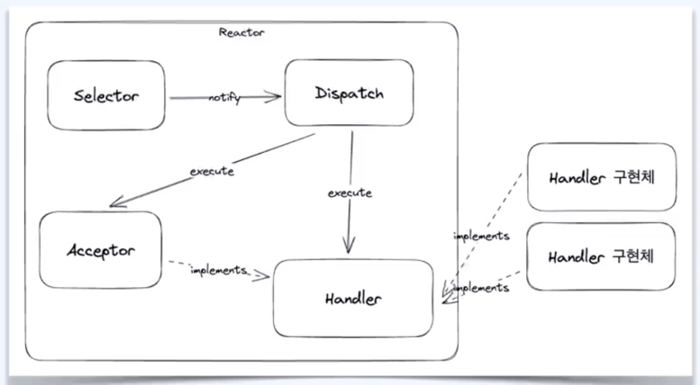
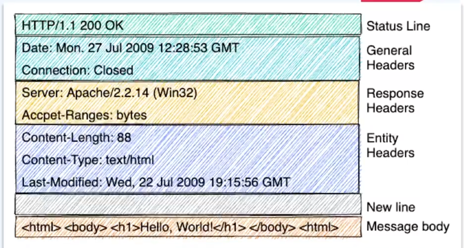
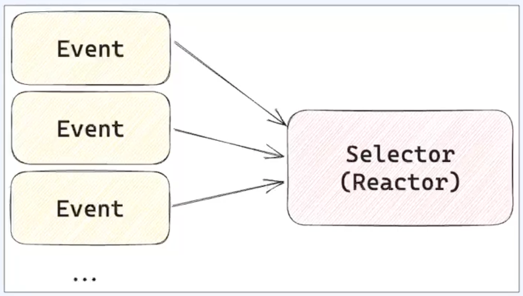

# Reactive Streams
1. Callee는 Caller에게 응답이 아닌 publisher를 제공한다.
2. Callee는 각각의 값을 publisher를 통해서 전달한다.
3. Caller는 해당 Publisher를 subscribe 하거나 다른 Caller에게 전달한다
4. Caller는 subscriber를 등록히여 back-pressure를 조절하여 처리 가능한 만큼만 전달 받는다.

- Callee는 publisher를 반환하고 Caller는 subcriber를 등록한다. 이 과정에서 Caller와 Callee는 비동기적으로 동작한다.
- publisher는 메세지 큐를 생성해서 부화를 관리하고 흐름을 제어한다. back-pressure를 조절할 수 있는 수단을 제공한다.

# Reactive Stream 구조

- 데이터 혹은 이벤트를 제공하는 Publisher
- 데이터 혹은 이벤트를 제공받는 Subscriber
- 데이터 흐름을 조절하는 Subscription

- Publisher   ---------->   Subscriber (onSubscribe)
  - Subscription (리모컨) 전달
    - cancel : 더 이상 요청을 받지 않을거야.
    - request : 내가 몇개의 요청을 받아 갈거야 
- data 이벤트   ---------->   onNext
- complete 이벤트 ---------->   onComplete
- error 이벤트  ---------->   onError                          

* JavaNIONonBlockingMultiServer
* JavaIOMultiClient

* Selector
* 
* 

* SelectorProvider 종류
* Selector 등록 (register)
  - Channel 에 selector 와 관심있는 이벤트 등록 (Selector sel, int ops)
  - Channel 의 register 내부 함수에 다시 selector 의 register 호출
* Selector 이벤트 타입 4가지
 
* Selector 에 Accept 작업 등록
* 

* SelectedKey
- 등록했던 channel 과 selector, 이벤트 타입을 포함
- channel 의 어떤 이벤트가 준비되었는지 체크 가능
* 

* I/O Multiplexing
* 
- 두 개 이상의 Channel 을 하나의 Selector 로 통합하는 과정
- Selector 를 이용해서 I/O Multiplexing 구현
- /spring-study/practices/selector/src/main/java/org/example/SelectorMultiServer.java

* Reactor pattern
- 동시에 들어오는 요청을 처리하는 이벤트 핸들링 패턴
- service handler 는 들어오는 요청들을 demultiplexing 해서 request handler 에게 동기적으로 전달
- accept, read, write 이밴트들을 한곳에 등록하여 관찰하고, 준비 완료된 이벤트들을 request handler 에게 전달한다
- selector 를 이용한 java nio 처리와 비슷하다

* Reactor
- 별도의 쓰레드에서 실행, 여러 요청의 이벤트를 등록하고 감시하며, 이벤트가 준비되면 dispatch 한다
  - Runable 을 구현
  - Selector 사용
  - EventHandler 인터페이스를 만들고 call

* Handler (EventHandler)
- Reactor 로 부터 이벤트를 받아서 처리한다 --> accept 이벤트와 read 이벤트 각각을 처리할수 있는 EventHandler 를 만든다.
- EventHandler 의 처리가 Reactor 에 영향을 주지 않아야 한다 --> EventHandler 에 별도의 쓰레드 실행

* Reactor Pattern
* 
- Reactor, Selector, Acceptor, EventHandler 구현체로 구성
- Acceptor : accept 이벤트에만 집중
- EventHandler : read 이벤트에만 집중

* HTTP 응답 구조
* 

* Reactor 의 문제점
* 

