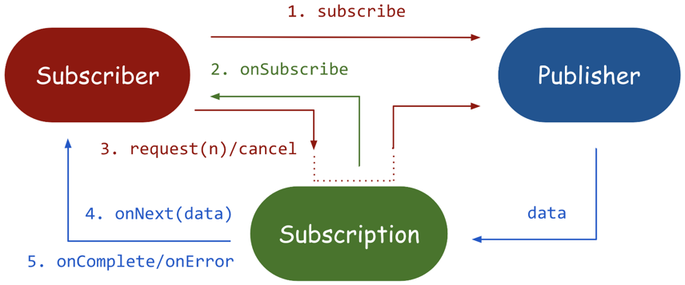

### publisher(발행) - subscriber(구독) 패턴에 대해서
- https://ksr930.tistory.com/258
- https://bgpark.tistory.com/159, https://bgpark.tistory.com/160
- https://zorba91.tistory.com/291
- https://phantasmicmeans.tistory.com/entry/Reactive-Streams-Publisher-Subscriber-Subscription
- https://www.saichoiblog.com/publisher-subscriber/

public interface Publisher<T> {
    void subscribe(Subscriber<? super T> var1);
}

public interface Subscriber<T> {
void onSubscribe(Subscription var1);
    void onNext(T var1);
    void onError(Throwable var1);
    void onComplete();
}

public interface Subscription {
    void request(long var1);
    void cancel();
}
