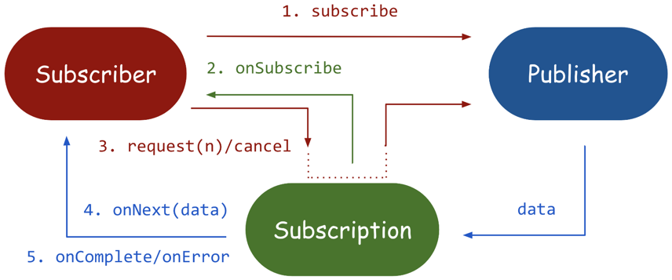
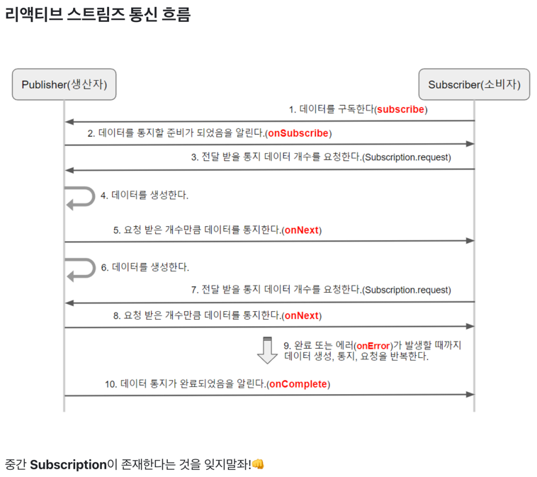

### publisher(발행) - subscriber(구독) 패턴에 대해서
- https://ksr930.tistory.com/258
- https://bgpark.tistory.com/159, https://bgpark.tistory.com/160
- https://zorba91.tistory.com/291
- https://phantasmicmeans.tistory.com/entry/Reactive-Streams-Publisher-Subscriber-Subscription
- https://www.saichoiblog.com/publisher-subscriber/




```java
public interface Publisher<T> {
    void subscribe(Subscriber<? super T> s);
}

public interface Subscriber<T> {
    void onSubscribe(Subscription s);
    void onNext(T t);
    void onError(Throwable t);
    void onComplete();
}

public interface Subscription {
    void request(long n);
    void cancel();
}
```

### Publisher
데이터 소스로 부터 데이터를 내보내는(emit) 역할을 담당한다.
subscribe() 추상 메서드는 Publisher가 내보내는 데이터를 수신할 지에(구독)대한 여부를 결정하는 메서드로, 
해당 메서드가 호출되지 않으면 Publisher가 데이터를 emit하는 프로세스는 시작되지 않는다.

### Subscriber
Publisher로 부터 내보내진 데이터를 소비하는 역할로 데이터를 전달받아 처리한다.
onSubscribe(Subscription s) : 구독이 시작되는 시점(데이터를 최초 통지할 때)에 호출되는 메서드로 
                              Subscription객체로 데이터의 구독 요청 및 해지 요청을 처리한다.
onNext(T t) : 데이터를 emit할 때 호출되며 emit된 데이터를 전달받아 소비하는 메서드
onError(Throwable t) : emit된 데이터가 Subscriber에 전달되는 과정에서 에러가 발생할 경우 호출되는 메서드
onComplete() : 데이터를 emit하는 과정이 종료될 경우 호출되는 메서드로 데이터의 emit이 정상적으로 완료된 후, 
               처리해야 될 작업을 해당 메서드 내에서 수행한다.

### Subscription
mit된 데이터의 개수를 요청하고 구독을 해지하는 역할
request(long n) : Publisher가 emit하는 데이터의 개수를 요청하는 메서드
cancel() : 구독을 해지하는 메서드




