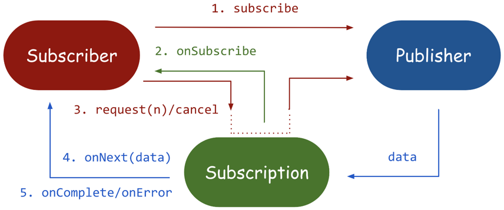

### 서적 : https://github.com/spring-boot-in-practice/repo
### 강의 : https://github.com/gaaon/webflux-examples



```java
public interface Publisher<T> {
    void subscribe(Subscriber<? super T> s);
}

public interface Subscriber<T> {
    void onSubscribe(Subscription s);
    void onNext(T t);
    void onError(Throwable t);
    void onComplete();
}

public interface Subscription {
    void request(long n);
    void cancel();
}

